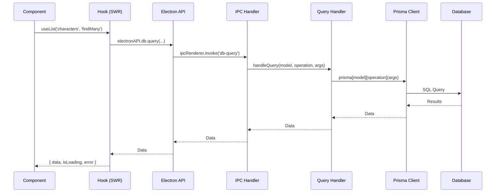
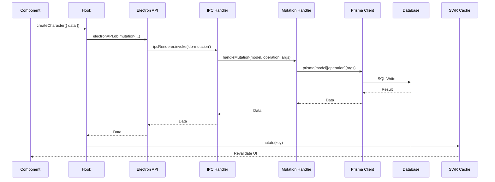
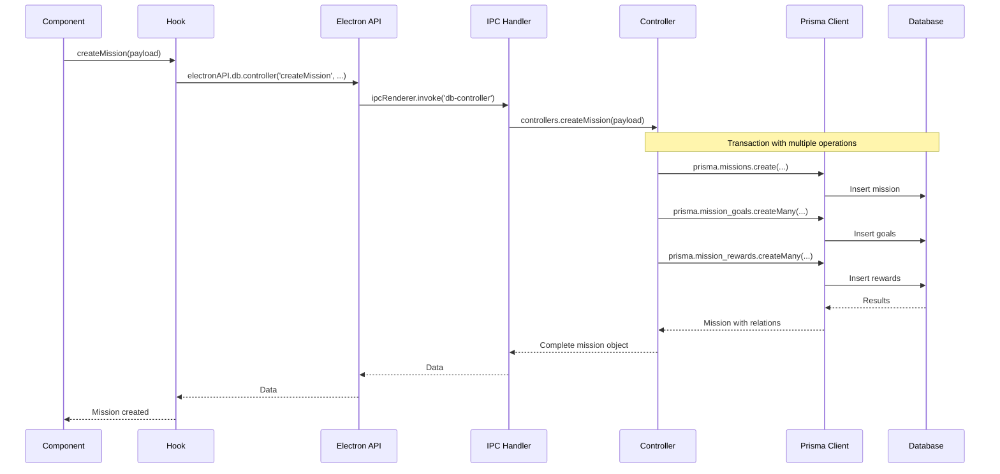

# Architecture

This document provides a detailed explanation of the Life as RPG application architecture, design patterns, and data flow.

## System Architecture

The application follows a **layered architecture** with clear separation of concerns:

```mermaid
graph TB
    subgraph "Renderer Process (React)"
        A[Components] --> B[Custom Hooks]
        B --> C[SWR Cache]
        B --> D[Electron API]
    end
    
    subgraph "IPC Bridge"
        D --> E[Preload Script]
        E --> F[IPC Channels]
    end
    
    subgraph "Main Process (Node.js)"
        F --> G[IPC Handlers]
        G --> H[Database Controllers]
        G --> I[Query Handlers]
        G --> J[Mutation Handlers]
        H --> K[Prisma Extensions]
        I --> K
        J --> K
        K --> L[Prisma Client]
        L --> M[(SQLite Database)]
    end
    
    style A fill:#61dafb
    style D fill:#47848f
    style L fill:#2d3748
    style M fill:#003b57
```



## Three-Layer Architecture

### 1. Presentation Layer (React Frontend)

**Location**: `src/`

The presentation layer is responsible for:
- Rendering UI components
- Handling user interactions
- Managing local state
- Displaying data from the backend

**Key Technologies**:
- React 19 with hooks
- TypeScript for type safety
- Tailwind CSS for styling
- HeroUI component library
- Framer Motion for animations

**Component Structure**:
```
src/components/
├── CharactersTable/          # Character selection and management
├── CharacterOverview/         # Character detail view
│   ├── MissionTable/         # Mission CRUD operations
│   ├── Resources/            # Character stats display
│   └── Store/                # Items, Skills, Magic stores
│       ├── Items/
│       ├── Skills/
│       └── Magic/
└── Header.tsx                # App header
```

### 2. IPC Communication Layer

**Location**: `electron/preload.cjs`, `electron/handlers.cjs`

The IPC layer bridges the renderer and main processes:

**Preload Script** (`electron/preload.cjs`):
```javascript
contextBridge.exposeInMainWorld('electronAPI', {
  db: {
    query: (model, operation, ...args) => 
      ipcRenderer.invoke('db-query', model, operation, ...args),
    mutation: (model, operation, ...args) => 
      ipcRenderer.invoke('db-mutation', model, operation, ...args),
    controller: (controllerName, ...args) => 
      ipcRenderer.invoke('db-controller', controllerName, ...args)
  }
})
```

**IPC Channels**:
- `db-query`: Read operations (findMany, findFirst, etc.)
- `db-mutation`: Write operations (create, update, delete)
- `db-controller`: Complex business logic operations

### 3. Data Layer (Electron Main Process)

**Location**: `electron/database/`

The data layer handles all database operations and business logic:

**Structure**:
```
electron/database/
├── prisma.cjs                # Prisma client singleton
├── client.cjs                # Extended Prisma client
├── query.cjs                 # Query handler
├── mutation.cjs              # Mutation handler
├── controller.cjs            # Controller dispatcher
├── controllers/              # Business logic controllers
│   ├── mission/             # Mission operations
│   ├── item/                # Item operations
│   ├── skill/               # Skill operations
│   └── magic/               # Magic operations
├── extensions/              # Prisma model extensions
└── services/                # Reusable service functions
```

## Design Patterns

### 1. Repository Pattern

The application uses a repository-like pattern through Prisma:

```typescript
// Query operations (read-only)
const characters = await electronAPI.db.query(
  'characters',
  'findMany',
  { where: { lvl: { gte: 5 } } }
)

// Mutation operations (write)
const newCharacter = await electronAPI.db.mutation(
  'characters',
  'create',
  { data: { name: 'Hero', lvl: 1 } }
)
```

### 2. Controller Pattern

Complex operations are encapsulated in controllers:

```typescript
// Create mission with goals and rewards
const mission = await electronAPI.db.controller(
  'createMission',
  {
    title: 'Daily Quest',
    description: 'Complete daily tasks',
    character_ref: characterId,
    goals: [{ description: 'Exercise' }],
    rewards: [{ reward_type: 'money', reward_amount: 100 }]
  }
)
```

### 3. Custom Hooks Pattern

React hooks encapsulate data fetching and state management:

**usePrismaMutation**: For write operations
```typescript
const [createCharacter, { isLoading, isError }] = usePrismaMutation(
  'characters',
  'create'
)

await createCharacter({ data: { name: 'Hero' } })
```

**usePrismaController**: For complex operations
```typescript
const [createMission, { isLoading, isError }] = usePrismaController(
  'createMission',
  'missions'
)

await createMission(missionData)
```

**useList**: For fetching and managing lists
```typescript
const { data, isLoading, error } = useList('characters', 'findMany')
```

### 4. Context Pattern

Character overview uses React Context for sharing state:

```typescript
// OverviewContext.ts
const OverviewContext = createContext<{ character: Character }>()

// Usage in CharacterOverview
<OverviewContext.Provider value={{ character: data }}>
  <Resources />
  <MissionsTable />
  <Store />
</OverviewContext.Provider>
```

### 5. Prisma Extensions

Custom model extensions add reusable methods:

```typescript
// extensions/character.cjs
Prisma.defineExtension({
  model: {
    characters: {
      async addXp(uid, amount) {
        // Custom logic for adding XP and leveling up
      }
    }
  }
})
```

## Data Flow

### Query Flow (Read Operations)



### Mutation Flow (Write Operations)



### Controller Flow (Complex Operations)



## State Management

### SWR for Server State

The application uses SWR for data fetching and caching:

**Benefits**:
- Automatic revalidation
- Deduplication of requests
- Cache management
- Optimistic UI updates

**Usage**:
```typescript
const { data, error, isLoading, mutate } = useSWR(
  'characters',
  () => fetchData('characters', 'findMany')
)
```

**Cache Invalidation**:
```typescript
// Invalidate specific key
mutate('characters')

// Invalidate by pattern
mutate((key) => typeof key === 'string' && key.startsWith('characters'))
```

### Local State with useState

Component-specific state uses React's `useState`:

```typescript
const [selectedCharacter, setSelectedCharacter] = useState<Character | null>(null)
```

## Security

### Context Isolation

Electron's context isolation is enabled:

```javascript
// electron/main.cjs
webPreferences: {
  contextIsolation: true,
  nodeIntegration: false,
  preload: path.join(basePath, 'preload.cjs')
}
```

This ensures:
- Renderer process cannot access Node.js APIs directly
- All communication goes through controlled IPC channels
- XSS attacks cannot access system resources

### Type Safety

TypeScript provides compile-time safety:

```typescript
// Type-safe database operations
type Models = Prisma.ModelName
type QueryOperations = 'findUnique' | 'findFirst' | 'findMany' | ...

// Enforced at compile time
electronAPI.db.query<M extends Models, O extends QueryOperations>(
  model: M,
  operation: O,
  ...args: Parameters<PrismaClient[M][O]>
)
```

## Performance Optimizations

### 1. SWR Caching

Reduces redundant database queries by caching results.

### 2. Lazy Loading

Components are loaded on-demand, reducing initial bundle size.

### 3. Optimistic Updates

UI updates immediately while mutations are in progress:

```typescript
mutate(
  'characters',
  async (current) => {
    // Optimistic update
    return [...current, newCharacter]
  },
  false // Don't revalidate immediately
)
```

### 4. Prisma Query Optimization

- Uses `select` to fetch only needed fields
- Includes relations only when necessary
- Batch operations with `createMany`, `updateMany`

## Error Handling

### Frontend Error Handling

Hooks return error states:

```typescript
const [mutate, { isLoading, isError }] = usePrismaMutation(...)

if (isError) {
  // Show error toast or message
}
```

### Backend Error Handling

Controllers wrap operations in try-catch:

```javascript
try {
  const result = await prisma.characters.create(data)
  return result
} catch (error) {
  console.error('Error creating character:', error)
  throw error
}
```

## Testing Strategy

While not currently implemented, the architecture supports:

- **Unit Tests**: Test individual controllers and services
- **Integration Tests**: Test IPC communication
- **E2E Tests**: Test complete user flows with Electron testing tools

## Scalability Considerations

The current architecture can scale by:

1. **Database Migration**: SQLite can be replaced with PostgreSQL/MySQL by changing Prisma datasource
2. **Multi-window Support**: Architecture supports multiple renderer windows
3. **Background Sync**: Can add background workers for sync operations
4. **Plugin System**: Controllers can be extended for custom features

## Next Steps

- Review [Database](https://github.com/Louai99k/life-as-rpg/blob/master/documentation/Database.md) for schema details
- Explore [Electron](https://github.com/Louai99k/life-as-rpg/blob/master/documentation/Electron.md) for IPC implementation
- Learn about [Frontend](https://github.com/Louai99k/life-as-rpg/blob/master/documentation/Frontend.md) components
