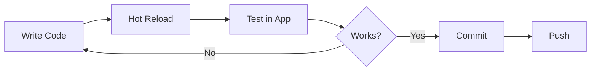

# Development Guide

This document provides best practices, coding standards, and development workflows for the Life as RPG project.

## Table of Contents

- [Development Workflow](#development-workflow)
- [Code Organization](#code-organization)
- [Coding Standards](#coding-standards)
- [Best Practices](#best-practices)
- [Common Patterns](#common-patterns)
- [Testing](#testing)
- [Debugging](#debugging)
- [Performance](#performance)
- [Contributing](#contributing)

## Development Workflow

### Setting Up Development Environment

1. **Clone and Install**:
```bash
git clone https://github.com/Louai99k/life-as-rpg.git
cd life-as-rpg
yarn install
```

2. **Start Development Server**:
```bash
yarn dev
```

This runs both Vite dev server (port 5173) and Electron concurrently.

### Development Cycle



### File Watching

- **Frontend**: Vite watches `src/` and hot-reloads changes
- **Electron**: Restart Electron manually after changes to `electron/`

**Tip**: Use `nodemon` for auto-restarting Electron:

```bash
# Install nodemon
yarn add -D nodemon

# Add script to package.json
"electron:watch": "nodemon --watch electron --exec 'electron .'"

# Run
yarn electron:watch
```

## Code Organization

### Directory Structure

```
life-as-rpg/
├── electron/                    # Electron main process
│   ├── database/               # Database layer
│   │   ├── controllers/       # Business logic
│   │   ├── extensions/        # Prisma extensions
│   │   ├── services/          # Reusable services
│   │   ├── query.cjs          # Query handler
│   │   ├── mutation.cjs       # Mutation handler
│   │   └── controller.cjs     # Controller dispatcher
│   ├── main.cjs               # Main process entry
│   ├── preload.cjs            # Preload script
│   └── handlers.cjs           # IPC handlers
├── src/                        # React frontend
│   ├── components/            # React components
│   │   ├── CharactersTable/  # Feature-based folders
│   │   ├── CharacterOverview/
│   │   └── Header.tsx
│   ├── hooks/                 # Custom hooks
│   ├── types/                 # TypeScript types
│   ├── utils/                 # Utility functions
│   ├── icons/                 # SVG icon components
│   ├── App.tsx                # Main app component
│   └── main.tsx               # React entry point
├── prisma/                     # Database schema
│   └── schema.prisma
├── documentation/              # Project documentation
└── public/                     # Static assets
```

### Naming Conventions

#### Files

- **Components**: PascalCase (e.g., `CharactersTable.tsx`)
- **Hooks**: camelCase with `use` prefix (e.g., `usePrismaMutation.ts`)
- **Utils**: camelCase (e.g., `fetcher.ts`)
- **Types**: camelCase (e.g., `mission.ts`)
- **Electron**: kebab-case with `.cjs` extension (e.g., `query.cjs`)

#### Variables and Functions

- **Variables**: camelCase (e.g., `selectedCharacter`)
- **Functions**: camelCase (e.g., `createMission`)
- **Components**: PascalCase (e.g., `CharactersTable`)
- **Constants**: UPPER_SNAKE_CASE (e.g., `REWARD_TYPES`)
- **Types/Interfaces**: PascalCase (e.g., `CreateMissionControllerPayload`)

#### Database

- **Models**: snake_case (e.g., `character_skills`)
- **Fields**: snake_case (e.g., `character_ref`)
- **UIDs**: Descriptive prefix (e.g., `char-123`, `mission-456`)

## Coding Standards

### TypeScript

#### Always Use Types

```typescript
// ✅ Good
const [character, setCharacter] = useState<Character | null>(null)

// ❌ Bad
const [character, setCharacter] = useState(null)
```

#### Prefer Interfaces for Objects

```typescript
// ✅ Good
interface CharacterProps {
  character: Character
  onSelect: (c: Character) => void
}

// ❌ Bad (for object shapes)
type CharacterProps = {
  character: Character
  onSelect: (c: Character) => void
}
```

#### Use Type Aliases for Unions

```typescript
// ✅ Good
type MissionRank = 'E' | 'D' | 'C' | 'B' | 'A' | 'S'

// ❌ Bad (for unions)
interface MissionRank {
  rank: 'E' | 'D' | 'C' | 'B' | 'A' | 'S'
}
```

#### Avoid `any`

```typescript
// ✅ Good
const handleSubmit = (data: CreateMissionPayload) => { }

// ❌ Bad
const handleSubmit = (data: any) => { }
```

### React

#### Functional Components

Always use functional components with hooks:

```typescript
// ✅ Good
const CharactersTable = ({ onSelect }: CharactersTableProps) => {
  const [data, setData] = useState([])
  return <div>...</div>
}

// ❌ Bad (class components)
class CharactersTable extends React.Component { }
```

#### Props Destructuring

```typescript
// ✅ Good
const CharacterCard = ({ character, onEdit }: CharacterCardProps) => {
  return <div>{character.name}</div>
}

// ❌ Bad
const CharacterCard = (props: CharacterCardProps) => {
  return <div>{props.character.name}</div>
}
```

#### Hooks Order

1. State hooks (`useState`, `useReducer`)
2. Context hooks (`useContext`)
3. Ref hooks (`useRef`)
4. Effect hooks (`useEffect`, `useLayoutEffect`)
5. Custom hooks
6. Memoization hooks (`useMemo`, `useCallback`)

```typescript
const Component = () => {
  // 1. State
  const [count, setCount] = useState(0)
  
  // 2. Context
  const { character } = useContext(OverviewContext)
  
  // 3. Refs
  const inputRef = useRef<HTMLInputElement>(null)
  
  // 4. Effects
  useEffect(() => { }, [])
  
  // 5. Custom hooks
  const [mutate] = usePrismaMutation('characters', 'create')
  
  // 6. Memoization
  const filteredData = useMemo(() => { }, [data])
  
  return <div>...</div>
}
```

### Prisma

#### Always Use Transactions for Multiple Operations

```typescript
// ✅ Good
await prisma.$transaction([
  prisma.missions.create({ data: missionData }),
  prisma.mission_goals.createMany({ data: goalsData })
])

// ❌ Bad (race conditions possible)
await prisma.missions.create({ data: missionData })
await prisma.mission_goals.createMany({ data: goalsData })
```

#### Use Select for Performance

```typescript
// ✅ Good (only fetch needed fields)
const characters = await prisma.characters.findMany({
  select: { uid: true, name: true, lvl: true }
})

// ❌ Bad (fetches all fields)
const characters = await prisma.characters.findMany()
```

## Best Practices

### Component Design

#### Single Responsibility

Each component should have one clear purpose:

```typescript
// ✅ Good
const CharacterName = ({ name }: { name: string }) => <h1>{name}</h1>
const CharacterLevel = ({ lvl }: { lvl: number }) => <span>Lvl {lvl}</span>

// ❌ Bad (too many responsibilities)
const CharacterInfo = ({ character }: { character: Character }) => {
  return (
    <div>
      <h1>{character.name}</h1>
      <span>Lvl {character.lvl}</span>
      <span>XP: {character.xp}</span>
      <button>Edit</button>
      <button>Delete</button>
      {/* ... many more things */}
    </div>
  )
}
```

#### Composition Over Props Drilling

```typescript
// ✅ Good (use context)
<OverviewContext.Provider value={{ character }}>
  <Resources />
  <MissionsTable />
</OverviewContext.Provider>

// ❌ Bad (props drilling)
<Resources character={character} />
<MissionsTable character={character} />
```

### State Management

#### Keep State Close to Where It's Used

```typescript
// ✅ Good (local state)
const CharactersTable = () => {
  const [filterValue, setFilterValue] = useState('')
  // filterValue only used in this component
}

// ❌ Bad (unnecessary global state)
const App = () => {
  const [filterValue, setFilterValue] = useState('')
  return <CharactersTable filterValue={filterValue} />
}
```

#### Use SWR for Server State

```typescript
// ✅ Good (SWR manages caching and revalidation)
const { data, isLoading } = useSWR('characters', fetcher)

// ❌ Bad (manual state management)
const [data, setData] = useState([])
const [isLoading, setIsLoading] = useState(false)
useEffect(() => {
  setIsLoading(true)
  fetchData().then(setData).finally(() => setIsLoading(false))
}, [])
```

### Error Handling

#### Always Handle Errors

```typescript
// ✅ Good
const [createCharacter, { isError }] = usePrismaMutation('characters', 'create')

if (isError) {
  toast.error('Failed to create character')
}

// ❌ Bad (silent failure)
const [createCharacter] = usePrismaMutation('characters', 'create')
await createCharacter(data) // Might fail silently
```

#### Provide User Feedback

```typescript
// ✅ Good
try {
  await createCharacter(data)
  toast.success('Character created!')
  onClose()
} catch (error) {
  toast.error('Failed to create character')
  console.error(error)
}

// ❌ Bad (no feedback)
try {
  await createCharacter(data)
  onClose()
} catch (error) {
  // Silent failure
}
```

### Performance

#### Lazy Load Heavy Components

```typescript
// ✅ Good
const AddCharacterModal = lazy(() => import('./AddCharacterModal'))

<Suspense fallback={<Loading />}>
  {showModal && <AddCharacterModal />}
</Suspense>

// ❌ Bad (always loaded)
import AddCharacterModal from './AddCharacterModal'
```

#### Memoize Expensive Computations

```typescript
// ✅ Good
const filteredData = useMemo(() => {
  return data.filter(item => item.name.includes(filterValue))
}, [data, filterValue])

// ❌ Bad (recalculates on every render)
const filteredData = data.filter(item => item.name.includes(filterValue))
```

#### Use useCallback for Event Handlers

```typescript
// ✅ Good
const handleClick = useCallback(() => {
  setCount(c => c + 1)
}, [])

// ❌ Bad (new function on every render)
const handleClick = () => {
  setCount(count + 1)
}
```

## Common Patterns

### Modal Pattern

```typescript
const Component = () => {
  const [showModal, setShowModal] = useState(false)
  const [modalData, setModalData] = useState<Data | null>(null)

  return (
    <>
      <Button onPress={() => setShowModal(true)}>Open</Button>
      
      <Suspense>
        {showModal && (
          <Modal
            data={modalData}
            onClose={() => {
              setShowModal(false)
              setModalData(null)
            }}
          />
        )}
      </Suspense>
    </>
  )
}
```

### Form Pattern

```typescript
const FormComponent = ({ onClose }: { onClose: () => void }) => {
  const [formData, setFormData] = useState(initialData)
  const [mutate, { isLoading, isError }] = usePrismaMutation('model', 'create')

  const handleSubmit = async () => {
    try {
      await mutate({ data: formData })
      toast.success('Success!')
      onClose()
    } catch (error) {
      toast.error('Failed!')
    }
  }

  return (
    <form onSubmit={handleSubmit}>
      <Input
        value={formData.name}
        onChange={(e) => setFormData({ ...formData, name: e.target.value })}
      />
      <Button type="submit" isLoading={isLoading}>
        Submit
      </Button>
    </form>
  )
}
```

### List Management Pattern

```typescript
const Component = () => {
  const { list, add, remove, editItem } = useList(initialList)

  return (
    <>
      {list.map(item => (
        <div key={item.uid}>
          {item.description}
          <Button onPress={() => remove('uid', item.uid)}>Remove</Button>
        </div>
      ))}
      <Button onPress={() => add({ uid: generateUID(), description: '' })}>
        Add
      </Button>
    </>
  )
}
```

## Testing

### Unit Testing (Recommended)

While not currently implemented, here's the recommended approach:

**Install Testing Libraries**:
```bash
yarn add -D vitest @testing-library/react @testing-library/jest-dom
```

**Test Example**:
```typescript
import { render, screen } from '@testing-library/react'
import { describe, it, expect } from 'vitest'
import CharacterCard from './CharacterCard'

describe('CharacterCard', () => {
  it('renders character name', () => {
    const character = { uid: '1', name: 'Hero', lvl: 5 }
    render(<CharacterCard character={character} />)
    expect(screen.getByText('Hero')).toBeInTheDocument()
  })
})
```

### Integration Testing

Test IPC communication:

```typescript
import { describe, it, expect } from 'vitest'

describe('Database Operations', () => {
  it('creates character', async () => {
    const character = await electronAPI.db.mutation('characters', 'create', {
      data: { uid: 'test-1', name: 'Test', lvl: 1 }
    })
    expect(character.name).toBe('Test')
  })
})
```

## Debugging

### Frontend Debugging

**Chrome DevTools**:
- Open DevTools: `Ctrl+Shift+I` (Windows/Linux) or `Cmd+Option+I` (Mac)
- React DevTools: Install React DevTools extension

**Console Logging**:
```typescript
console.log('Character:', character)
console.table(characters)
console.error('Error:', error)
```

### Electron Debugging

**Main Process**:
```javascript
// electron/main.cjs
console.log('Main process log')

// Run with inspect flag
electron --inspect=5858 .
```

**Renderer Process**:
Same as frontend debugging (Chrome DevTools).

### Database Debugging

**Prisma Logging**:
```javascript
// electron/database/prisma.cjs
const prisma = new PrismaClient({
  log: ['query', 'info', 'warn', 'error']
})
```

**SQLite Browser**:
Use [DB Browser for SQLite](https://sqlitebrowser.org/) to inspect `data.db`.

## Performance

### Profiling

**React Profiler**:
```typescript
import { Profiler } from 'react'

<Profiler id="CharactersTable" onRender={onRenderCallback}>
  <CharactersTable />
</Profiler>
```

**Chrome Performance Tab**:
1. Open DevTools
2. Go to Performance tab
3. Record interaction
4. Analyze flame graph

### Optimization Checklist

- [ ] Lazy load heavy components
- [ ] Memoize expensive computations
- [ ] Use `useCallback` for event handlers
- [ ] Optimize database queries (use `select`, avoid over-fetching)
- [ ] Use SWR for caching
- [ ] Minimize re-renders (React.memo, useMemo)
- [ ] Code splitting with dynamic imports

## Contributing

### Git Workflow

1. **Create Feature Branch**:
```bash
git checkout -b feature/mission-filters
```

2. **Make Changes and Commit**:
```bash
git add .
git commit -m "feat: add mission filters"
```

3. **Push and Create PR**:
```bash
git push origin feature/mission-filters
```

### Commit Message Convention

Follow [Conventional Commits](https://www.conventionalcommits.org/):

- `feat:` New feature
- `fix:` Bug fix
- `docs:` Documentation changes
- `style:` Code style changes (formatting)
- `refactor:` Code refactoring
- `test:` Adding tests
- `chore:` Maintenance tasks

**Examples**:
```
feat: add mission progress tracking
fix: resolve character deletion bug
docs: update API reference
refactor: simplify mission controller
```

### Code Review Checklist

- [ ] Code follows style guide
- [ ] Types are properly defined
- [ ] Error handling is implemented
- [ ] No console.log statements (use proper logging)
- [ ] Components are properly tested
- [ ] Documentation is updated
- [ ] No breaking changes (or documented)

## Build and Deploy

### Building for Production

```bash
yarn build
```

This will:
1. Generate Prisma client
2. Build Vite frontend to `dist-vite/`
3. Package Electron app with electron-builder

### Distribution

Built apps will be in `dist/` directory:
- Windows: `.exe` installer
- macOS: `.dmg` installer
- Linux: `.AppImage` or `.deb`

### Docker Build

For cross-platform builds (e.g., Windows from Linux):

```bash
docker-compose up
```

See [docker-compose.yaml](https://github.com/Louai99k/life-as-rpg/blob/master/docker-compose.yaml) for configuration.

## Troubleshooting

### Common Issues

**Issue**: Prisma client not found
**Solution**: Run `npx prisma generate`

**Issue**: Port 5173 already in use
**Solution**: Change port in `vite.config.ts` or kill process using the port

**Issue**: Database locked
**Solution**: Close all app instances and restart

**Issue**: Hot reload not working
**Solution**: Check Vite config and ensure files are in `src/`

## Resources

- [React Documentation](https://react.dev/)
- [TypeScript Handbook](https://www.typescriptlang.org/docs/)
- [Prisma Documentation](https://www.prisma.io/docs/)
- [Electron Documentation](https://www.electronjs.org/docs/)
- [Tailwind CSS Documentation](https://tailwindcss.com/docs)
- [SWR Documentation](https://swr.vercel.app/)

## Next Steps

- Review [Architecture](https://github.com/Louai99k/life-as-rpg/blob/master/documentation/Architecture.md) for system design
- Explore [Frontend](https://github.com/Louai99k/life-as-rpg/blob/master/documentation/Frontend.md) for component patterns
- Check [API Reference](https://github.com/Louai99k/life-as-rpg/blob/master/documentation/API-Reference.md) for types
