# Life as RPG - Documentation Overview

## Introduction

**Life as RPG** is an Electron-based desktop application that gamifies personal development by treating your life as a role-playing game. The application allows you to create characters, manage skills, items, magic abilities, and complete missions to level up and progress in your personal journey.

## Key Features

- **Character Management**: Create and manage multiple characters with levels, experience points (XP), and Ki (energy)
- **Mission System**: Create missions with goals, rewards, and track progress
- **Skills & Magic**: Learn and level up various skills and magical abilities
- **Item Store**: Purchase and manage items with an in-game currency system
- **Reward System**: Complete missions to earn money, items, skills, or magic abilities
- **Offline-First**: All data stored locally using SQLite database

## Technology Stack

### Frontend
- **React 19.1.1**: Modern UI library with hooks
- **TypeScript**: Type-safe development
- **Tailwind CSS 4.1.14**: Utility-first CSS framework
- **HeroUI**: Component library for consistent UI
- **Framer Motion**: Smooth animations
- **SWR**: Data fetching and caching

### Backend
- **Electron 38.3.0**: Cross-platform desktop application framework
- **Prisma 6.17.1**: Type-safe ORM for database operations
- **SQLite**: Lightweight embedded database

### Build Tools
- **Vite 7.1.7**: Fast build tool and dev server
- **Electron Builder**: Package and distribute the application
- **Docker**: Cross-platform build support (Windows builds from Linux)

## Project Structure

```
life-as-rpg/
├── electron/                 # Electron main process
│   ├── database/            # Database handlers and controllers
│   ├── main.cjs             # Main process entry point
│   ├── preload.cjs          # Preload script for IPC
│   └── handlers.cjs         # IPC handler setup
├── src/                     # React frontend
│   ├── components/          # React components
│   ├── hooks/               # Custom React hooks
│   ├── types/               # TypeScript type definitions
│   ├── utils/               # Utility functions
│   ├── icons/               # SVG icon components
│   ├── App.tsx              # Main app component
│   └── main.tsx             # React entry point
├── prisma/                  # Database schema
│   └── schema.prisma        # Prisma schema definition
├── documentation/           # Project documentation
├── public/                  # Static assets
├── package.json             # Dependencies and scripts
├── vite.config.ts           # Vite configuration
└── tsconfig.json            # TypeScript configuration
```

## Architecture Overview

The application follows a **three-layer architecture**:

1. **Presentation Layer (React)**: UI components and user interactions
2. **IPC Layer (Electron)**: Communication bridge between renderer and main process
3. **Data Layer (Prisma + SQLite)**: Database operations and business logic

```mermaid
graph TB
    A[React Components] --> B[Custom Hooks]
    B --> C[Electron IPC]
    C --> D[IPC Handlers]
    D --> E[Database Controllers]
    E --> F[Prisma Client]
    F --> G[SQLite Database]
    
    style A fill:#61dafb
    style C fill:#47848f
    style F fill:#2d3748
    style G fill:#003b57
```



## Core Concepts

### Characters
Characters are the main entities in the application. Each character has:
- Name and unique ID
- Level and experience points
- Ki (energy) and max Ki
- Money for purchasing items
- Associated skills, magic, items, and missions

### Missions
Missions are tasks that characters complete to earn rewards:
- **Types**: Daily, weekly, or custom
- **Ranks**: Difficulty levels (E, D, C, B, A, S)
- **Goals**: Specific objectives to complete
- **Rewards**: XP, money, items, skills, or magic

### Skills & Magic
Abilities that characters can learn and level up:
- Each has a maximum level
- Can be purchased from the store
- Associated with character progression

### Items
Purchasable goods from the store:
- Can be bought and sold
- Have quantity limits
- Used as mission rewards

## Getting Started

For detailed setup instructions, see [Getting Started](https://github.com/Louai99k/life-as-rpg/blob/master/documentation/Getting-Started.md)

For architecture details, see [Architecture](https://github.com/Louai99k/life-as-rpg/blob/master/documentation/Architecture.md)

## Documentation Index

- **[Getting Started](https://github.com/Louai99k/life-as-rpg/blob/master/documentation/Getting-Started.md)**: Installation and setup
- **[Architecture](https://github.com/Louai99k/life-as-rpg/blob/master/documentation/Architecture.md)**: System design and patterns
- **[Database](https://github.com/Louai99k/life-as-rpg/blob/master/documentation/Database.md)**: Schema and data models
- **[Electron](https://github.com/Louai99k/life-as-rpg/blob/master/documentation/Electron.md)**: Main process and IPC
- **[Frontend](https://github.com/Louai99k/life-as-rpg/blob/master/documentation/Frontend.md)**: React components and hooks
- **[API Reference](https://github.com/Louai99k/life-as-rpg/blob/master/documentation/API-Reference.md)**: Type definitions and interfaces
- **[Development](https://github.com/Louai99k/life-as-rpg/blob/master/documentation/Development.md)**: Workflow and best practices

## Quick Links

- **Repository**: [https://github.com/Louai99k/life-as-rpg](https://github.com/Louai99k/life-as-rpg)
- **Issues**: [https://github.com/Louai99k/life-as-rpg/issues](https://github.com/Louai99k/life-as-rpg/issues)
- **Author**: Louai99k

## License

ISC License
